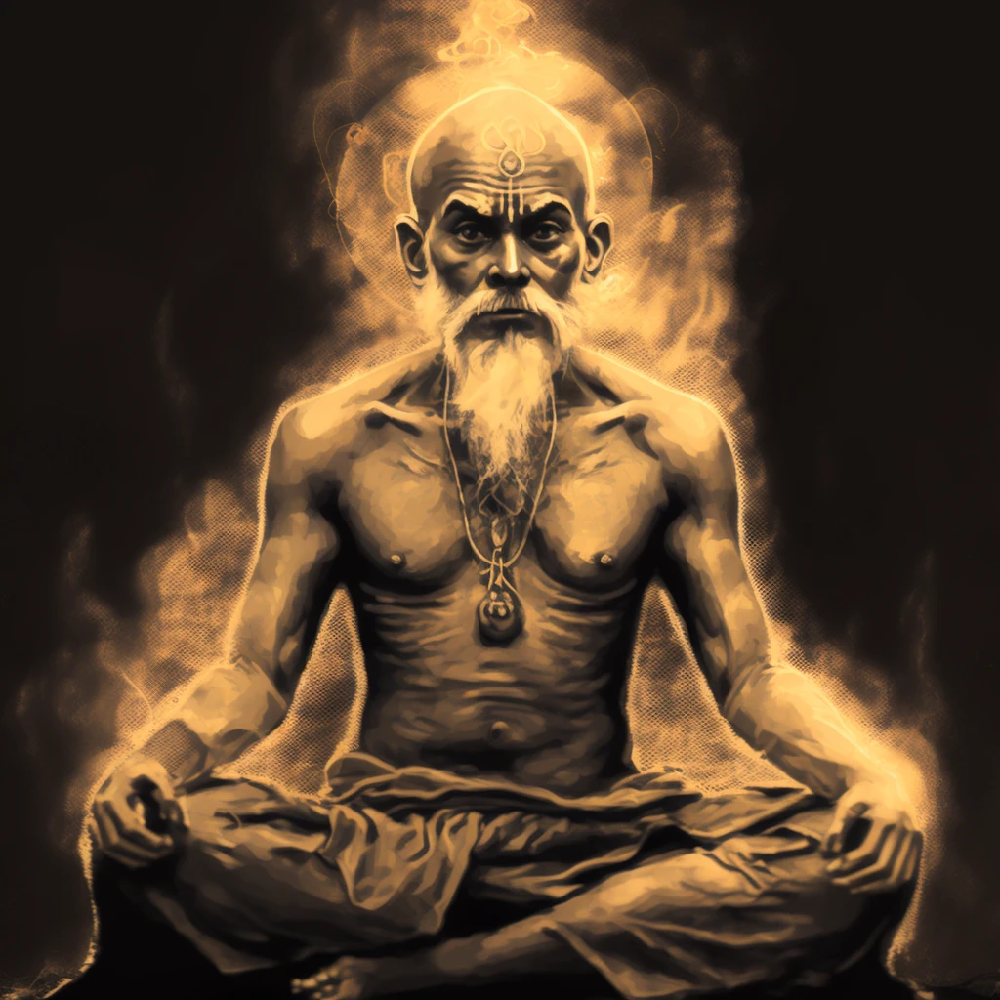

+++
title = "The AI Journey So Far"
date = "2023-03-03"
author = "quest"
authorTwitter = "zquestz"
cover = "images/ai.webp"
coverCredit = "AI Expanse"
tags = ["ai"]
keywords = ["ai"]
summary = "Everywhere you look today, people are talking about artificial intelligence (AI). People are creating stunning art using Midjourney and DALL-E. AI based chat bots have become infinitely more powerful. Using ChatGPT can feel like magic… a conversational something. What that is, is a debate for another day."
+++

Everywhere you look today, people are talking about artificial intelligence (AI). People are creating stunning art using [Midjourney](https://midjourney.com) and [DALL-E](https://labs.openai.com/). AI based chat bots have become infinitely more powerful. Using [ChatGPT](https://chat.openai.com) can feel like magic... a conversational _something_. What that is, is a debate for another day.

## Intention

Many people haven't explored these new tools yet, and I want to demystify the process. Walk through the process of signing up for the most common services. Plus provide a few tips I have found along the way.

## Generating Images with Midjourney

There are many services out there that will generate images for you. However the most popular is [Midjourney](https://midjourney.com). While their service is easy to use once you are setup, it does require a Discord account, as all image generation is done within their Discord server.

Once you sign up to [Discord](https://discord.com/) and create an account, make sure you validate your email address. You won't be able to login to Midjourney until that is complete.

Now you can visit [https://midjourney.com](https://midjourney.com) and click `Join The Beta`. This will login to their Discord server. You should see a white sailboat icon on the left side of the main Discord window.

To start generating images, just type `/imagine` in one of the newcomer rooms. Then you will provide it the prompt text, hit enter, then wait a minute or so for the request to be fulfilled. If you want to control the aspect ratio, you can append `--ar 16:9` to your prompts to make them wide format.

Once you have generated some images, you can view them on the Midjourney website by clicking `Sign In`. This authorizes against your Discord account. Midjourney build a profile of all their users requests and upscales. You can find me [here](https://www.midjourney.com/app/users/f8ecd0b9-86f9-4621-bfb1-5326ecfa0182/).

### A Few Examples

Below are a few images I generated, plus the prompts I used.

_Prompt: master yogi eminating power_

_Prompt: elf queen with elaborate headpiece and throne_

_Prompt: entity capable of creating universes, skin has high levels of detail and textures, photo realistic, cosmic origin, guardian_

_Prompt: the soul represented as beams of light traveling through the cosmos HDR_

Lastly, the banner of this post was generated by Midjourney.

Don't try to generate anything with text. It will not work, and will say the wrong things. We aren't ready to get automated stationary and business cards just yet. While there are lots of prompts that provide incredible results, there are many cases where the generated images are unusable.

### How Does it Work?

To keep this post short(er), let me refer you to this article:
[How Do DALL·E 2, Stable Diffusion, and Midjourney Work?](https://www.marktechpost.com/2022/11/14/how-do-dall%C2%B7e-2-stable-diffusion-and-midjourney-work/).

## Who is OpenAI?

[OpenAI](https://openai.com) is one of the most innovative companies in the space. They have several popular [products](https://openai.com/product), but I will only focus on two, ChatGPT and DALL-E.

[DALL-E](https://labs.openai.com/) is OpenAI's image generation product. It is very similar to Midjourney and I would highly suggest you try them both, as they have very different results. DALL-E does have one main advantage, you don't need a Discord account, and you can easily use the web to generate images.

## ChatGPT

[ChatGPT](https://chat.openai.com) is the first natural language bot I have used that can actually hold a conversation. You ask it things in a prompt, and it replies the best it can. It remembers things you have told it, and is extremely useful editing content.

To start using ChatGPT first you need to sign up for an [OpenAI](https://openai.com/) account. Once you have created your account just visit [https://chat.openai.com](https://chat.openai.com).

This will bring you into the ChatGPT website and allow you to initiate chats. What you do in these chats is limited only by your imagination.

Here are a few things I have used ChatGPT for:

- Editing emails/tweets
- Helping draft web content
- Asking random questions
- Writing short stories

ChatGPT is extremely versatile, after you play with it for a while, you are bound to find some utility.

Note that ChatGPT can provide incorrect data, and should not be relied on to be 100% accurate. Always check the content it produces.

## The Future

While it is remarkable how far these tools have come, they still require artists and designers to guide their creativity. It will be interesting to see how people build on top of this technology and how it weaves into societies artistic expression.
