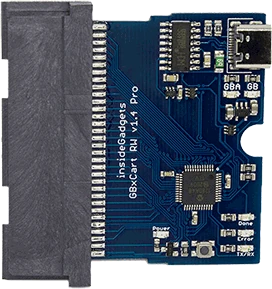

+++
title = "ModRetro Chromatic: Building the Ultimate Game Boy"
date = "2025-02-06"
author = "quest"
authorTwitter = "zquestz"
cover = "images/chromatic.webp"
coverCredit = "ModRetro Chromatic"
tags = ["gaming", "hardware"]
keywords = ["gaming", "hardware"]
summary = "The ModRetro Chromatic arrived with a bold claim: to be the ultimate tribute to Nintendo's Game Boy. Built with premium materials - a synthetic sapphire screen cover, magnesium-aluminum alloy shell, and PBT buttons - it delivers on that promise. But for those of us deep in the retro gaming world, there's always room for more. After preordering the limited Midnight edition and later adding a GameStop unit for multiplayer, I began exploring ways to transform this already impressive device into something even more special."
+++

The [ModRetro Chromatic][modretro] arrived with a bold claim: to be the ultimate tribute to Nintendo's Game Boy. Built with premium materials - a synthetic sapphire screen cover, magnesium-aluminum alloy shell, and PBT buttons - it delivers on that promise. But for those of us deep in the retro gaming world, there's always room for more. After preordering the limited [Midnight edition][midnight] and later adding a [GameStop][gamestop] unit for multiplayer, I began exploring ways to transform this already impressive device into something even more special.

This isn't just about collecting games - it's about creating the ultimate Game Boy experience. With the right combination of hardware additions, we can build something truly remarkable. Let me show you how.

## The Base Hardware: ModRetro Chromatic

As Palmer Luckey detailed in his [announcement][announcement], the Chromatic's attention to detail sets it apart. The custom 160x144 pixel sunlight-readable display perfectly mimics the size, resolution, and subpixel structure of the Game Boy Color. Every aspect has been carefully considered - from the perfectly weighted buttons to the fully implemented link cable port - something many modern handhelds overlook.

But while the Chromatic is excellent out of the box, we can take it further. Much further. The first step in building our ultimate setup is preserving our original game collection. For that, we need the GBxCart RW.

## Preserving Your Collection: GBxCart RW

As a collector of Game Boy cartridges, preserving both the games and their save files was a priority. The [GBxCart RW][gbxcart] solves this perfectly - a simple but powerful \$33 device that connects your cartridges directly to your computer. It handles three crucial tasks:

- Backs up your physical games to ROM files
- Saves and restores game save data
- Allows you to flash compatible cartridges

Using the [FlashGBX][flashgbx] application (available for Windows, Mac, and Linux), the backup process is straightforward. Insert your cartridge, connect via USB, and the intuitive interface handles the rest. You can even automatically append the current date/time to your save backups, ensuring you never lose progress in your favorite games.

With our collection safely preserved, the next step was finding a way to carry every Game Boy and Game Boy Color game ever made in a single cartridge. Enter the EverDrive-GB X7.

## The Ultimate Upgrade: EverDrive-GB X7

The [EverDrive-GB X7][everdrive] is where this setup truly becomes magical. Created by [Krikzz][krikzz], this premium flash cart transforms the Chromatic into a device capable of playing virtually every Game Boy and Game Boy Color game ever made. Just add a microSD card, load it with your backed-up games, and you've got instant access to thousands of titles.

The X7 comes packed with features that enhance the gaming experience:

- Save states that save instantly
- Real-time clock support for games like Pokémon
- Game Genie cheat code support
- In-game menu for quick access to features
- Instant loading of games
- Support for up to 1000 files per folder

The build quality matches the Chromatic's premium feel, featuring a high-quality 4-layer PCB and hard gold plating for the cartridge contacts. It even includes a proper reset button on top of the cartridge, making it easy to return to the menu without powering off your device.

Setting up the EverDrive-GB X7 is straightforward. Format your microSD card to FAT32, download the latest OS from Krikzz's website, and copy your backed-up games to the card. Note that the EverDrive only supports uncompressed ROM files (.gb and .gbc) - compressed formats like .zip or .gz are not supported. The OS is clean and responsive, letting you navigate your game library with ease. Plus, the X7's isolated RTC function means games like Pokémon Gold and Silver maintain accurate time without interfering with each other.

With our games preserved and accessible, there's one final piece needed to complete the ultimate Game Boy experience - multiplayer support.

## Linking Up: The Multiplayer Experience

Multiplayer was always essential to the Game Boy experience. Whether trading Pokémon or competing in Tetris, connecting with friends defined the platform. The [Ullnosoo GBC Link Cable][linkcable] works perfectly with the Chromatic, featuring firm connectors, proper shielding, and a durable 3.9-foot cord that gives you plenty of room to play comfortably.

Setting up multiplayer is exactly like it was back in the day: plug in the cable, boot up your game on both systems, and you're ready to go. I've tested it extensively with both Game Boy and Game Boy Color titles, and the experience is flawless. There's something special about playing Tetris head-to-head on modern hardware that feels exactly like the original.

## Putting It All Together: The Ultimate Game Boy Experience

With all these pieces in place - two [ModRetro Chromatics][modretro], the [GBxCart RW][gbxcart] for backups, an [EverDrive-GB X7][everdrive], and a [link cable][linkcable] - we've created something special. This isn't just a way to play Game Boy games; it's a complete solution that combines the best of modern technology with the authentic feel of the original hardware.

Here's how it all works together:

1. Use the GBxCart RW to back up your physical collection, preserving both the games and their save files. This ensures your original cartridges stay safe while providing the ROMs needed for the EverDrive.

2. Load your backed-up games onto the EverDrive-GB X7's microSD card. With support for thousands of games, you can carry your entire collection in a single cartridge. The instant loading means no waiting around - just pick a game and play.

3. When you want to play multiplayer, the link cable seamlessly connects two Chromatics together. Whether you're using original cartridges or the EverDrive, the experience is identical to the original hardware. Trade Pokémon, battle friends in Tetris, or enjoy any other multiplayer Game Boy game.

The beauty of this setup is that it maintains the authentic feel of the original Game Boy while adding modern conveniences. You have instant access to every game, save states when you need them, and the ability to back up your progress. Plus, with two Chromatics and a link cable, you can relive the magic of multiplayer gaming exactly as it was meant to be experienced.

## Essential Games for Your Collection

With our ultimate Game Boy setup complete, let's look at some must-play titles that showcase what makes this platform special.

### Tetris: The Definitive Portable Puzzle

The Game Boy version of Tetris is widely considered the quintessential edition of this classic puzzle game. Some of my fondest childhood memories involve playing Tetris with my family, and the version that comes bundled with the Chromatic brilliantly recreates this experience. With its responsive controls, iconic music, and head-to-head multiplayer support, it's simply the best version of Tetris ever made. Whether you're a puzzle game enthusiast or just starting out, this is an essential experience that showcases why Tetris and the Game Boy were meant for each other.

### The Legend of Zelda Trilogy

The Game Boy Color received three incredible Zelda adventures, each offering unique mechanics and stunning pixel art:

**Link's Awakening DX** - A masterful remake of the Game Boy original, adding color and an exclusive dungeon. The save state feature helps preserve progress in this lengthy adventure.

**Oracle of Ages** and **Oracle of Seasons** - This ingenious pair of games introduced unique mechanics (time travel and season changing) while maintaining the classic Zelda formula. Using the link cable, you can unlock additional content by connecting both games.

With original cartridges of the trilogy now commanding prices well over \$100 each, having these masterpieces readily available on the EverDrive is particularly valuable.

### Pokémon Gold and Silver

These sequels revolutionized the Pokémon formula by adding a day/night cycle, breeding mechanics, and 100 new Pokémon. The EverDrive's real-time clock support ensures the time-based events work perfectly - something that's increasingly rare with original cartridges due to dying batteries. The link cable enables trading and battling, while the huge post-game surprise of exploring the entire Kanto region makes this one of the most content-rich Game Boy Color titles ever released.

### Super Mario Bros. Deluxe

Standing out as the finest Mario game released for the Game Boy platform, Super Mario Bros. Deluxe is much more than just a port of the NES classic. It packed in new features including a challenge mode, multiplayer racing, and even a proper save system. The Chromatic's screen makes the vibrant colors pop, while save states help you master those speedrun strategies. For Mario fans, this is a must-play title that shows just how much care Nintendo put into their Game Boy Color releases.

### R-Type DX

Having grown up playing R-Type on the Sega Genesis, I was skeptical about how well it would translate to the Game Boy. I couldn't have been more wrong. This enhanced compilation combines both Game Boy R-Type releases with Game Boy Color support, creating an outstanding portable version of this legendary shoot-'em-up. The Chromatic's responsive controls and crisp display make weaving through waves of enemies more satisfying than ever. For anyone who loves shoot-'em-ups on the go, this is a must-play title that demonstrates just how capable the Game Boy Color really was.

## Conclusion

We often talk about "ultimate" setups in the retro gaming world, but this combination of the [ModRetro Chromatic][modretro] and carefully chosen accessories truly earns that title. By focusing on preservation, complete library access, and authentic multiplayer, we've created something that goes beyond just playing old games.

The total investment isn't small. Two Chromatics (\$199 each), an [EverDrive-GB X7][everdrive], a [link cable][linkcable], and the [GBxCart RW][gbxcart] will set you back around \$600. But for that price, you get something unique: a complete Game Boy ecosystem that preserves the past while eliminating historical limitations. No more worrying about dying save batteries, no need to track down rare cartridges, and no compromises on the multiplayer experiences that made these games special.

For those who love the Game Boy, who appreciate both its history and its games, this is as good as it gets. Whether you're backing up childhood favorites, exploring titles you missed the first time around, or challenging friends to a game of Tetris, this setup provides the perfect way to experience these classics.

The future may be retro, but it's never looked quite this good.

[modretro]: https://modretro.com/
[midnight]: https://modretro.com/products/chromatic-tetris-bundle?variant=47637522776366
[gamestop]: https://www.gamestop.com/consoles-hardware/retro-consoles/products/modretro-chromatic-gamestop-exclusive/414495.html
[announcement]: https://modretro.com/blogs/blog/the-future-is-retro
[gbxcart]: https://www.gbxcart.com/
[flashgbx]: https://github.com/lesserkuma/FlashGBX
[krikzz]: https://krikzz.com/
[everdrive]: https://krikzz.com/our-products/cartridges/edgbx7.html
[linkcable]: https://www.amazon.com/dp/B09JNVH53S
