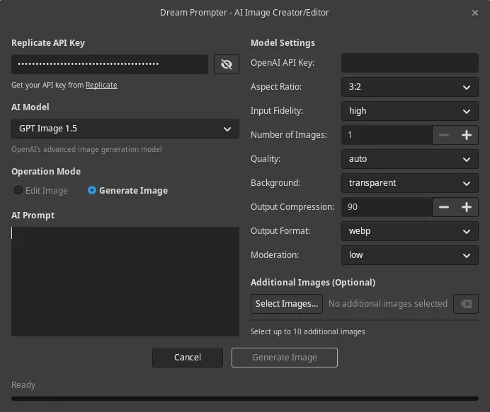

+++
title = "Dream Prompter 1.2.0: The Evolution Continues"
date = "2025-12-17"
author = "quest"
authorTwitter = "zquestz"
cover = "images/dream-prompter.webp"
coverCredit = "Dream Prompter"
tags = ["ai", "code"]
keywords = ["ai", "code"]
summary = "A few months ago, Dream Prompter launched as a GIMP plugin for AI-powered image generation and editing, supporting just one model: Google's Nano Banana. Version 1.2.0 brings the total to nine. Here's what changed and how it all came together."
+++

A few months ago, [Dream Prompter](/posts/dream-prompter/) launched as a GIMP plugin for AI-powered image generation and editing, supporting just one model: Google's Nano Banana. Version 1.2.0 brings the total to nine. Here's what changed and how it all came together.

## What's New in 1.2.0

This release adds three new models:

- **[GPT Image 1.5](https://openai.com/index/new-chatgpt-images-is-here/)** from OpenAI brings faster generation and true transparent background support for assets that drop right into your projects.
- **[Nano Banana Pro](https://blog.google/technology/ai/nano-banana-pro/)**, built on Google's Gemini 3 Pro, offers up to 4K resolution and precise editing capabilities.
- **[Qwen Image](https://github.com/QwenLM/Qwen-Image)** from Alibaba excels at complex text rendering across multiple languages.

Three existing models were upgraded: **Nano Banana** moves from preview to full release, **Flux** jumps from 1.1 Pro to 2 Pro, and **Seedream** upgrades from 4 to 4.5 with improved reference preservation.

## The Evolution

How did Dream Prompter grow from one model to nine? It comes down to two decisions: choosing the right API provider and building for extensibility.

### The Move to Replicate

The original Dream Prompter connected directly to Google's Generative AI API. It worked, but it locked the plugin to a single provider. When I started looking at adding more models, [Replicate](https://replicate.com/) was the obvious choice with the largest selection of models, an easy-to-use API, affordable pricing, and access to commercial models from major AI companies. One integration, many models.

### Building for Multiple Models

With Replicate as the foundation, I rebuilt the model system to be modular. Each model is its own self-contained unit that defines its capabilities, parameters, and API interaction. A base class handles the common patterns, and a registration system lets models plug themselves in. Adding a new model means creating a single Python file that follows the pattern, and the rest of the plugin picks it up automatically.

This is why staying current is sustainable. When a model gets upgraded or a new one hits Replicate, adding it to Dream Prompter is straightforward rather than a major undertaking.

The AI image generation space is moving fast. Every few months, models get better at understanding prompts, preserving details, and producing consistent results. By building Dream Prompter to easily adopt new models, users get access to these improvements as they happen.

## Try It Out

Dream Prompter is available on [GitHub](https://github.com/zquestz/dream-prompter) with installation instructions for Linux, macOS, and Windows. The modular architecture means more models are always on the horizon. If there's one you'd like to see, open an issue. And if you want to contribute, I'd love to have you.