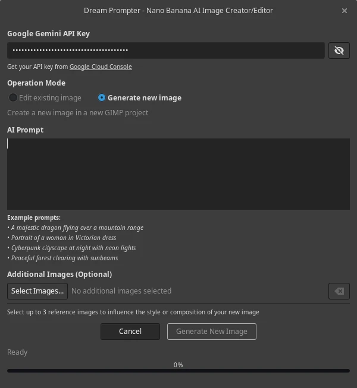
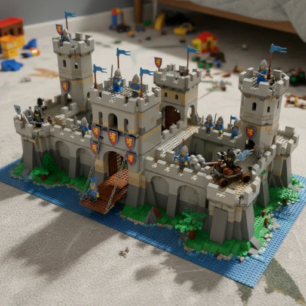
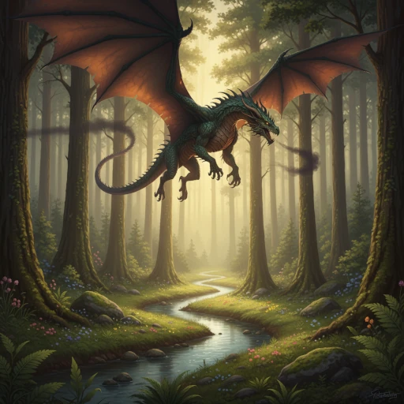

+++
title = "Dream Prompter: Bringing Nano Banana to GIMP"
date = "2025-09-01"
author = "quest"
authorTwitter = "zquestz"
cover = "images/dream-prompter.webp"
coverCredit = "Dream Prompter"
tags = ["ai", "code"]
keywords = ["ai", "code"]
summary = "I'll be honest - I'd never written a GIMP plugin before. I'm also fairly new to Python, having only dabbled with a few small projects. While I've been doing development for decades, this was uncharted territory for me. So when I decided to bring Google's new Gemini 2.5 Flash Image Preview model (nicknamed \"Nano Banana\") directly into GIMP, I knew I'd need some help. Enter Claude, to help me fill in the missing knowledge gaps."
+++

I'll be honest - I'd never written a GIMP plugin before. I'm also fairly new to Python, having only dabbled with a few small projects. While I've been doing development for decades, this was uncharted territory for me. So when I decided to bring Google's new Gemini 2.5 Flash Image Preview model (nicknamed "Nano Banana") directly into GIMP, I knew I'd need some help. Enter Claude, to help me fill in the missing knowledge gaps.

What started as an experiment became [Dream Prompter](https://github.com/zquestz/dream-prompter) - a full-featured GIMP plugin that lets you generate and edit images using AI, right from your familiar GIMP workflow. Whether you're creating entirely new images from text descriptions or transforming existing artwork with natural language prompts, it integrates seamlessly into the creative process.

# Why GIMP Needed This

While standalone AI image generators are everywhere, having to jump between applications breaks your creative flow. You're working on a design in GIMP, need to add a specific element, so you switch to a web interface, generate an image, download it, import it back... it's clunky.

More fundamentally, GIMP needs better AI integrations. The creative software landscape is rapidly evolving, with AI becoming a core part of the design process. Yet most AI tools exist in isolation, forcing artists to cobble together workflows across multiple applications. What's missing is seamless integration that feels native to your existing creative process.

Dream Prompter eliminates that friction. Hit `Filters → AI → Dream Prompter...`, describe what you want, and get results as properly named layers directly in your project. No context switching, no manual file juggling. All generations and edits are completely non-destructive, your original work remains untouched while AI results appear as new layers. The AI becomes just another tool in your GIMP toolkit, as accessible as any filter or adjustment layer.

# The Claude Collaboration

Here's where it gets interesting - I built this entire plugin while being completely new to GIMP's Python API. Claude helped me navigate the documentation, understand the architecture, and write code that actually works. We tackled everything from GTK interface design to threading for non-blocking API calls.

The collaboration was fascinating. Working in [Zed](https://zed.dev) (which I absolutely love), I'd describe what I wanted and Claude would not only implement it, but anticipate needs I hadn't even thought of. When I asked for API integration, Claude automatically implemented proper threading patterns to keep the UI responsive - I knew not to block the main thread, but it was impressive that Claude handled this without any prompting. When I hit roadblocks with GIMP's image handling, Claude helped me understand the pixel buffer system.

What impressed me most was the iterative process. Claude initially created everything in a single file, but I didn't like that approach. I pushed for breaking down functionality into separate concerns, and we built a clean modular architecture:

- `dream-prompter.py` - Main GIMP plugin entry point
- `api.py` - Google Gemini API integration
- `dialog.py` - Main dialog coordination
- `dialog_gtk.py` - GTK user interface components
- `dialog_events.py` - Event handling and user interactions
- `dialog_threads.py` - Background processing and threading
- `integrator.py` - GIMP-specific operations
- `settings.py` - Configuration persistence
- `i18n.py` - Internationalization support

The best part? This entire plugin came together in just two days, from initial concept to working code with full internationalization support.

# Key Features That Matter

Dream Prompter isn't just a basic wrapper around an API. It includes features that make it genuinely useful:

**Dual Operation Modes**: Generate entirely new images or edit existing ones with natural language prompts. The editing mode is particularly powerful - you can say "change the background to a forest" or "make this person wear a red dress" and it works.

**Reference Image Support**: Upload up to 3 reference images for generation, or 2 for editing (plus your current image). This gives you much more control over style and composition.

**Smart Layer Management**: Results automatically appear as new layers with descriptive names, so your project stays organized.

**Multi-language Support**: The interface works in 11 languages, with translations for English, Spanish, French, Portuguese, Russian, Japanese, Hindi, Bengali, Chinese (Simplified/Traditional), and Korean.

**Gemini API Compliance**: The plugin automatically handles all of Gemini's requirements - file size limits (7MB max), attachment limits (up to 3 images), and supported formats (PNG, JPEG, WebP only). No need to worry about the technical constraints.

# Seeing It In Action

Here's what the Dream Prompter interface looks like in GIMP:

The interface is clean and straightforward - choose your mode (Generate or Edit), write your prompt, optionally add reference images, and hit generate. Progress updates keep you informed while the AI works in the background, and results appear as new layers with descriptive names.

# Example Results

Here are some examples of what Dream Prompter can create using Google's Nano Banana model (including the cover image for this post):

**Pure Generation:**
_"A lego fortress"_

**Another Pure Generation:**
_"A majestic dragon flying over snow-capped mountains at sunset"_

**Image Editing:**
_"Change the background to a peaceful forest clearing"_

**Style Transfer:**
_"Transform this into a charcoal painting"_

# The Reality Check

Let me be upfront about the limitations. This requires Google's paid Gemini API - the free tier doesn't include image generation. You'll need billing enabled, and each generation counts toward your usage. You need to monitor your spending yourself.

The plugin also requires GIMP 3.0.x and the `google-genai` Python library. File sizes are limited to 7MB per reference image, and it only supports PNG, JPEG, and WebP formats.

# Installation and Getting Started

Installation is straightforward but varies by platform. I've included detailed instructions for Linux, Windows, and macOS, plus there's even an AUR package for Arch users (`yay -S dream-prompter`).

The workflow is simple:

1. Open an image (for editing) or the plugin will create a new document (for generation)
2. Launch Dream Prompter from the Filters menu
3. Enter your Google API key (saved automatically)
4. Choose your mode and write a descriptive prompt
5. Generate and watch your new layer appear

# What I Learned

Building this taught me a lot about both Python and GIMP's architecture. The plugin system is more sophisticated than I expected, with proper internationalization support, threading patterns, and UI responsiveness requirements.

Working with Claude was like pair programming with someone who never gets tired and has read all the documentation. I fed Claude the [GIMP documentation](https://developer.gimp.org/api/3.0/libgimp/index.html) and the [Google GenAI docs](https://github.com/googleapis/python-genai). When I'd get stuck on GIMP's pixel buffer handling or GTK event systems, Claude could explain not just what to do, but why it worked that way.

# I Want Your Feedback

This is one of my first Python projects and my first GIMP plugin. I'm sure there are things I could improve, patterns I could implement better, or features that would make it more useful.

If you try it out, I'd love to hear:

- What works well for your workflow?
- What feels clunky or could be smoother?
- Are there prompting patterns that work better than others?
- What features am I missing?

# Looking for Contributors

More importantly, I'd love additional contributors. Whether you're experienced with GIMP plugin development, Python, or just have ideas for improvements, there's room for everyone.

Areas where help would be particularly valuable:

- **Testing**: Different systems, different workflows, edge cases I haven't found
- **Documentation**: Better examples, troubleshooting guides, workflow tips
- **Features**: New capabilities while maintaining the core simplicity
- **Translations**: Additional language support beyond the current 11

The code is clean and modular, so it's approachable even if you're not familiar with GIMP's API. Claude helped ensure good documentation and clear separation of concerns.

# Try It Out

Dream Prompter is available on [GitHub](https://github.com/zquestz/dream-prompter) with detailed installation instructions. Whether you're a digital artist looking to integrate AI into your workflow, or a developer curious about GIMP plugin architecture, I'd love to see what you think.

This project proved to me that with the right AI assistance, you can tackle domains you've never worked in before. I went from never having written a GIMP plugin to building something genuinely useful, all while learning Python patterns and GUI development along the way.

The future of creative tools is integrating AI directly into existing workflows, not replacing them. Dream Prompter is my contribution to that future - built by someone new to the space, with help from AI, for a community that values both innovation and craftsmanship.
