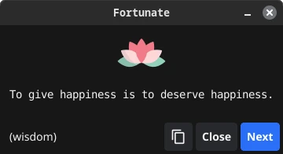

+++
title = "Fortunate: A Modern Motivational App for Linux"
date = "2024-11-16"
author = "quest"
authorTwitter = "zquestz"
cover = "posts/fortunate/images/fortunate.webp"
coverCredit = "Fortunate"
tags = ["code", "linux"]
keywords = ["code", "linux"]
summary = "Recently, I found myself searching for a polished motivational app for Linux, but everything I discovered either required using the terminal or had interfaces that felt outdated. Knowing the wealth of wisdom available in fortune-mod's databases, I decided to create Fortunate, a modern graphical interface that delivers inspiring quotes throughout your day, while giving me an opportunity to explore GUI development with Fyne."
+++

Recently, I found myself searching for a polished motivational app for Linux, but everything I discovered either required using the terminal or had interfaces that felt outdated. Knowing the wealth of wisdom available in fortune-mod's databases, I decided to create [Fortunate](https://github.com/zquestz/fortunate), a modern graphical interface that delivers inspiring quotes throughout your day, while giving me an opportunity to explore GUI development with [Fyne](https://fyne.io).

## A Modern Approach

Fortunate runs quietly in your system tray, providing inspiration at your fingertips. Whether you're looking for a mindful moment during a busy workday or a fresh perspective when tackling challenges, click the lotus icon for an immediate quote, or let the notification system deliver wisdom at intervals of your choice. The clean interface ensures the app feels at home on any modern Linux desktop.



## Beyond the Terminal

`fortune-mod` has been a staple of Unix systems for decades. Fortunate brings these timeless quotes into the modern era with a polished graphical experience, making inspiration seamlessly accessible.

The application features:

- Dark/light icon themes
- Configurable notification frequency
- Selection of specific fortune databases

## Custom Collections

Fortunate ships with three carefully curated databases, each designed to provide different forms of inspiration:

- **appreciation**: Quotes focusing on gratitude and mindfulness
- **inspiration**: Thoughts about wonder and possibility
- **motivation**: Empowering messages about personal growth

Right-click the lotus icon in your system tray to access Settings, where you can enable your preferred collections.

## Getting Started

Installation is quick and easy. For Arch Linux users:

```bash
yay -S fortunate
```

For those who prefer building from source:

```bash
git clone https://github.com/zquestz/fortunate
cd fortunate
make
sudo make install
```

The project is open source and available on [GitHub](https://github.com/zquestz/fortunate), where you'll find detailed installation instructions and can participate in its development.

## The Path Forward

MacOS and Windows support is nearly complete, requiring only packaging work and minor tweaks - if you're interested in helping bring Fortunate to these platforms, please reach out. I'm also excited to expand our custom fortune collections with more thoughtful, curated content that resonates with different aspects of personal growth.

I hope you find Fortunate as useful as I do in bringing a bit of inspiration to your day.
