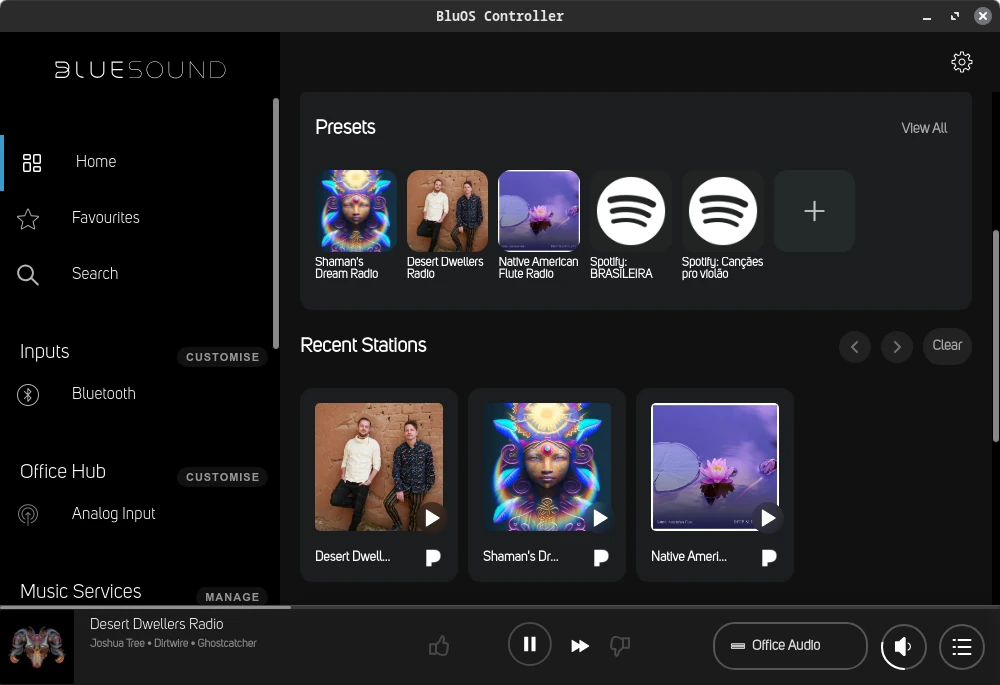

+++
title = "Goodbye Sonos, Hello Bluesound"
date = "2024-10-06"
author = "quest"
authorTwitter = "zquestz"
cover = "posts/goodbye-sonos-hello-bluesound/images/bluesound.webp"
coverCredit = "Bluesound"
tags = ["audio", "hardware"]
keywords = ["audio", "hardware"]
summary = "Music has always been an essential part of my life, and for years, my Sonos system satisfied that need, until a disastrous app update forced me to look elsewhere. This is the story of my switch to the Bluesound ecosystem and how it transformed my listening experience."
+++

Music has always been an essential part of my life, and for years, my [Sonos](https://www.sonos.com/) system satisfied that need, until a disastrous app update forced me to look elsewhere. This is the story of my switch to the [Bluesound](https://bluesound.com/) ecosystem and how it transformed my listening experience.

## The Sonos Days

When I moved into my home a little over three years ago, I knew I needed the right music system. The house already had built-in speakers throughout, and I wanted to reuse them. After reviewing the available options, I decided to buy eight [Sonos Port](https://www.sonos.com/en-us/shop/port) units to power all the rooms.

At first, the setup was amazing. I could play music from all my devices, and it supported all my online music services. Primarily, I used Pandora, Spotify, and streamed from my local music library. The app wasn't spectacular, but it was stable and worked reliably.

One of the best features was the [Last.fm](https://www.last.fm/) integration, which scrobbled everything played in my house. This allowed me to track what my guests listened to and review my own listening habits. Curious about my musical tastes? Check out my [Last.fm profile](https://www.last.fm/user/zquestz).

However, one day in April, everything changed. Sonos decided to ship the worst app update I have ever seen. It was a complete disaster. I could no longer reliably connect to my Sonos devices, my local music library was no longer accessible, the app was slow, and the UI was terrible. I was forced to downgrade to an older version of the app, which luckily worked since I was on Android. Unfortunately, iOS users didn't have that option.

I looked online, and I was definitely not the only one having issues. You can see the bevy of awful reviews on the [Google Play Store](https://play.google.com/store/apps/details?id=com.sonos.acr2).

Then, instead of rolling back the obviously broken release, Sonos doubled down. They released a firmware update that broke older app versions, forcing everyone to upgrade. Downgrading was no longer an option.

After months of issues, during which I couldn't even play music reliably, I decided enough was enough. Sonos had lost a customer for life. What had once been a seamless part of my day turned into a constant source of frustration, and I knew it was time for a change.

## Exploring Alternatives

There aren't many alternatives to Sonos. The two main ones I found were [WiiM](https://www.wiimhome.com/) and [Bluesound](https://bluesound.com/). I had heard good things about both, but the [Bluesound Hub](https://www.bluesound.com/zz/hub) seemed particularly useful. WiiM didn't have an equivalent product, so I figured I could use the Bluesound Hub to connect my turntables and stream my old-school house records throughout the house. It turned out to be the perfect solution.

I also use [Control4](https://control4.com/) for home automation, which offers drivers for both Bluesound and WiiM. However, the WiiM drivers were new, and I wanted something with a proven track record.

I know quite a few people who are happy with their WiiM devices, and I think either would have suited my needs, but I ended up deciding on Bluesound.

## My Bluesound Experience

The [Bluesound Node](https://www.bluesound.com/usa/node-n130) was a direct replacement for my Sonos Port units. I ordered eight of them, along with one Bluesound Hub, and eagerly awaited their arrival.

A couple of weeks later, they arrived, and I started the replacement process. Within a couple of hours, everything was up and running. The setup was straightforward, and I could immediately stream music from my local library, Pandora, Spotify, and my turntables. The Bluesound products feel premium, clearly designed for audiophiles.

Their mobile app, [BluOS](https://play.google.com/store/apps/details?id=com.lenbrook.sovi.bluesound), worked seamlessly, detecting my hardware with no issues. It was a vast improvement over the Sonos app, and I couldn't have been happier with my purchase.

Of course, no migration is without a few hiccups. First, BluOS doesn't support as many music services as Sonos. It lacks integration with [Plex](https://support1.bluesound.com/hc/en-us/community/posts/13767442434327-Plex-support-showing-up-on-competitive-streamers), [Last.fm](https://support1.bluesound.com/hc/en-us/community/posts/360001829254-Last-fm-scrobbling), and [SoundCloud](https://support1.bluesound.com/hc/en-us/community/posts/17461525824279-Soundcloud-integration). If you check the linked forum posts, you'll see that Bluesound isn't very responsive to requests for these services. Additionally, Bluesound doesn't have an official way to control their players from a Linux system, whereas Sonos offered a web player.

I began to worry. Did I jump the gun? Was I going to be stuck with a system that didn't support all my music services?

## Finding Solutions

First, I needed Last.fm integration. A home system without scrobbling was a deal-breaker. Fortunately, I found [blu-hawaii](https://github.com/jliuhtonen/blu-hawaii), a lightweight solution that runs perfectly on my Synology NAS through Docker. The setup was straightforward, and now all the music played in my house is scrobbled again. The developer, Janne Liuhtonen, was also very responsive and extremely helpful.

Next, I needed a way to control BluOS players from my Linux system. Once again, the community came to the rescue. Users had been discussing this issue for five years, and some power users had developed a solution.

Since BluOS Controller is an electron application, they patched the official releases and built an AppImage for Linux. This process is automated on GitLab, and you can find the repo at [bluos-controller-linux](https://gitlab.com/fabrice.aeschbacher/bluos-controller-linux). I contributed by adding [bluos-controller-appimage](https://aur.archlinux.org/packages/bluos-controller-appimage) to the Arch User Repository (AUR). I wish Bluesound would officially support Linux or offer a web-based version, but their focus appears to be more on hardware than on improving software.

Losing Plex support was disappointing, but I mostly stream from my own Plex server, which is on the same network. Fortunately, BluOS players can index the same music library as my Plex server, and local library support is solid. The BluOS indexer isn't as feature-rich as Plex, and it doesn't pull as much metadata, but I can easily navigate folders on my local music share and add them to my playlists. I hope Bluesound adds Plex support in the future, but for now, I can manage.

The only service I lost was SoundCloud, with no solid workaround. While disappointing, it hasn't affected me much since I wasn't a heavy SoundCloud user.

## Was It Worth It?

In short, absolutely! Once everything was set up and I worked through a few issues with help from the community, the system has run flawlessly.

The sound quality is excellent, the BluOS app is stable, and all my key music services are supported. I do wish the Bluesound team was more responsive to customer feedback, but the community is strong and dedicated to helping each other.

Overall, the switch to Bluesound has re-energized my enjoyment of listening to music at home. The improved sound quality, seamless app experience, and support from the community have reaffirmed that this was the right choice for me.

Goodbye Sonos, and hello Bluesound!
