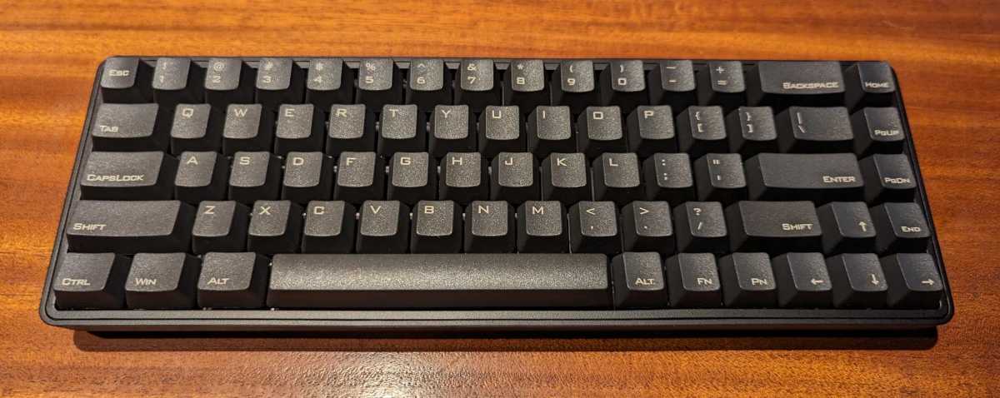

+++
title = "Searching for the Perfect Keyboard"
date = "2023-08-24"
author = "quest"
authorTwitter = "zquestz"
cover = "posts/perfect-keyboard/images/gmmk2.webp"
coverCredit = "GMMK 2 Keyboard"
tags = ["hardware", "keyboards"]
keywords = ["hardware", "keyboards"]
summary = "For years, I've been using a CODE Keyboard equipped with Cherry MX Clear switches. It has served me faithfully, but recently, I've felt the need to try something different. Given the plethora of options now available, I embarked on a quest to find the perfect keyboard."
+++

For years, I've been using a [CODE Keyboard](https://codekeyboards.com/) equipped with [Cherry MX Clear](https://www.cherrymx.de/en/cherry-mx/mx-special/mx-clear.html) switches. It has served me faithfully, but recently, I've felt the need to try something different. Given the plethora of options now available, I embarked on a quest to find the perfect keyboard.

Initially, I had to decide on the size. Having used a full-size keyboard, I was certain I wanted something more compact, but arrow keys were non-negotiable. Thus, I settled on a 65% keyboard design.

I also considered the [Ultimate Hacking Keyboard](https://ultimatehackingkeyboard.com/), even going so far as to order their [Switch Tester](https://ultimatehackingkeyboard.com/product/switch-tester). However, I ultimately decided against purchasing one. For the curious, I found their white switches quite appealing.

The mechanical keyboard market is vast. I spent days researching and finally decided to order a few for comparison.

## The Ordering Begins

Knowing my affinity for Cherry MX Clear switches, I wanted at least one of my new keyboards to feature them. I'm not one for flashy gadgets, and the sheer simplicity of the [Vortex Keyboard Cypher Single Spacebar US1](https://vortexgear.store/products/cypher-single-spacebar-us1) caught my eye. Plus, keyboards with Cherry MX Clear switches were becoming rare. So, that was my first order.

But my shopping spree wasn't over. I needed for something unique. The [GMMK 2](https://www.gloriousgaming.com/products/gmmk2) offered full customization, and I couldn't resist designing my own. My order included:

- GMMK 2 Barebones Gaming Keyboard
- Glorious Panda Tactile Switches
- Coiled Keyboard Cable
- US (ANSI) Base Set / Black GMMK ABS Doubleshot Keycaps v2
- Black Ash GPBT - Premium Dye Sub Keycaps
- Padded Keyboard Wrist Rest (Stealth)
- Keyboard Carrying Case

Admittedly, I went a tad overboard, but the idea of assembling my own keyboard was too exciting to pass up.

Lastly, I chose the [Drop ALT Mechanical Keyboard](https://drop.com/buy/drop-alt-mechanical-keyboard) due to its aesthetic appeal and stellar reviews. I opted for Cherry MX Brown switches to diversify my collection.

## The Arrivals

The Vortex Keyboard was the first to arrive.

Despite its all-plastic casing, the build quality is commendable. The keycaps feel robust, and the typing experience mirrors that of my CODE. While I was pleased, I eagerly awaited the other keyboards, suspecting the best was still on the horizon. This was a very basic unit after all. No fancy backlighting found here!

Soon after, the shipment from Glorious arrived with all the components for my GMMK 2. I meticulously assembled it, starting with the 65 [Glorious Panda Tactile Switches](https://www.gloriousgaming.com/products/glorious-panda-mechanical-switches). Initially, I used the Black Ash Keycaps but later switched to the [US (ANSI) Base Set](https://www.gloriousgaming.com/products/gmmk-keycaps).

However, there was a snag. Glorious doesn't provide keycaps with media keys for custom models - a significant oversight. I reached out to their support, and they confirmed that premium keycaps come exclusively with the prebuilt model.

Despite this, the keyboard is exceptional. The switches offer a delightful typing experience, and I believe I've discovered my new favorite switches. The keycaps, though lacking some features, are of superior quality. Fortunately, I could reference the premium keycaps on their website to locate my media keys.

The Drop ALT is still en route, currently in California. I'm eagerly anticipating its arrival, especially since I managed to order it before it sold out.

The GMMK 2 has set a high bar, quickly becoming my top keyboard choice.

## A Minor Hiccup

For terminal users, the tilde (~) is crucial. By default, the GMMK 2 assigns `~` to shift-fn-escape which is extremely inconvenient to type. I resolved this by remapping `~` to shift-escape by appending `xmodmap -e 'keysym Escape = Escape asciitilde Escape'` to my `.profile`. While it's possible to flash custom firmware, it seemed excessive for a single key remap.

## Final Thoughts

Currently, the GMMK 2 reigns supreme on my desk. However, the Drop ALT might challenge its position in a future episode. Stay tuned!
