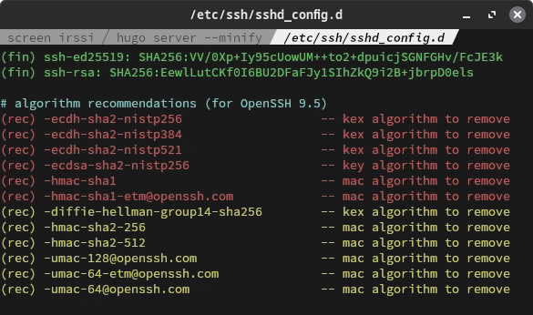
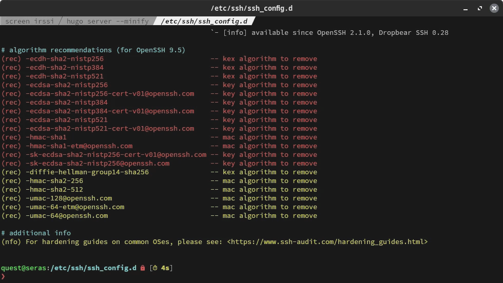

+++
title = "SSH Hardening with ssh-audit"
date = "2023-10-15T18:16:52-10:00"
author = "quest"
authorTwitter = "zquestz"
cover = "images/ssh.webp"
coverCredit = "SSH Hardening"
tags = ["privacy", "security"]
keywords = ["privacy", "security"]
summary = "Today I explored ssh-audit, a tool designed to audit SSH configurations. Although it’s an excellent tool, I found the hardening guides somewhat lacking. Hence, I decided to write a detailed walkthrough, ensuring the ssh/sshd configurations are easily readable."
+++

Today I explored [ssh-audit](https://github.com/jtesta/ssh-audit), a tool designed to audit SSH configurations. Although it's an excellent tool, I found the [hardening guides](https://www.ssh-audit.com/hardening_guides.html) somewhat lacking. Hence, I decided to write a detailed walkthrough, ensuring the ssh/sshd configurations are easily readable.

The ssh-audit tool is important for several reasons:

- **SSH Protocol Analysis**: The tool can identify the SSH protocol version and provide details about the supported key exchange, encryption, MAC, and compression algorithms. This is crucial for understanding the security posture of an SSH server.

- **Security Vulnerability Detection**: ssh-audit can detect known vulnerabilities in the SSH server. This helps administrators identify and patch potential security risks.

- **Algorithm Recommendations**: Based on the analysis, ssh-audit provides recommendations on which algorithms should be enabled or disabled to enhance security.

## Getting Started

Setting up ssh-audit is straightforward. Simply follow the installation instructions on their [project page](https://github.com/jtesta/ssh-audit), and you'll be ready in no time.

While it's not mentioned on their GitHub, there's a package available on the [Arch Linux User Repository](https://aur.archlinux.org). You can install it using your preferred AUR helper:

```sh
yay -S ssh-audit
```

## Running ssh-audit

After installation, ensure sshd is active. Then, execute ssh-audit with the command:

```sh
ssh-audit localhost
```

This command produces a comprehensive security report. Pay special attention to the lines highlighted in red and yellow, as these indicate areas requiring attention.

Here's a snapshot of my algorithm recommendations. While yours might differ slightly, the approach to resolving issues remains the same.



Observe the three primary types to eliminate: `kex`, `mac`, and `key`. These correspond to `KexAlgorithms`, `MACs`, and `HostKeyAlgorithms` in your sshd configuration.

## Updating sshd

Armed with a list of issues, it's time to modify our sshd configuration. I created a file `/etc/ssh/sshd_config.d/90-hardening.conf` with the content:

```conf
KexAlgorithms -diffie-hellman-group14-sha256,ecdh-sha2-nistp256,ecdh-sha2-nistp384,ecdh-sha2-nistp521
Macs -hmac-sha1,hmac-sha1-etm@openssh.com,hmac-sha2-256,hmac-sha2-512,umac-128@openssh.com,umac-64-etm@openssh.com,umac-64@openssh.com
HostKeyAlgorithms -ecdsa-sha2-nistp256
```

By prefixing values with `-`, we ensure the removal of insecure configurations from the default set.

After updating, restart sshd and run `ssh-audit localhost`. You should no longer see any security warnings!

## Updating ssh

While your sshd is now more secure, it's essential to ensure your ssh client also employs a secure configuration.

In one terminal window, enter:

```zsh
ssh-audit -c
```

In another window, connect to the ssh-audit process by accessing port 2222:

```zsh
ssh -p 2222 localhost
```

This will display a report on your ssh client. Here are the recommendations from my initial run:



Again, we encounter the same `kex`, `mac`, and `key` types. They map to `KexAlgorithms`, `MACs`, and `HostKeyAlgorithms` in your ssh configuration.

I created a file `/etc/ssh/ssh_config.d/90-hardening.conf` with the following:

```conf
KexAlgorithms -diffie-hellman-group14-sha256,ecdh-sha2-nistp256,ecdh-sha2-nistp384,ecdh-sha2-nistp521
Macs -hmac-sha1,hmac-sha1-etm@openssh.com,hmac-sha2-256,hmac-sha2-512,umac-128@openssh.com,umac-64-etm@openssh.com,umac-64@openssh.com
HostKeyAlgorithms -ecdsa-sha2-nistp256,ecdsa-sha2-nistp256-cert-v01@openssh.com,ecdsa-sha2-nistp384,ecdsa-sha2-nistp384-cert-v01@openssh.com,ecdsa-sha2-nistp521,ecdsa-sha2-nistp521-cert-v01@openssh.com,sk-ecdsa-sha2-nistp256-cert-v01@openssh.com,sk-ecdsa-sha2-nistp256@openssh.com
```

When you execute `ssh-audit -c` and conduct your tests, you should no longer encounter any security warnings!

## Final Thoughts

SSH hardening is an ongoing process, and while tools like ssh-audit provide a solid foundation, it's essential to stay updated with the latest security practices. Regularly auditing and updating your configurations will ensure a safer digital environment.
