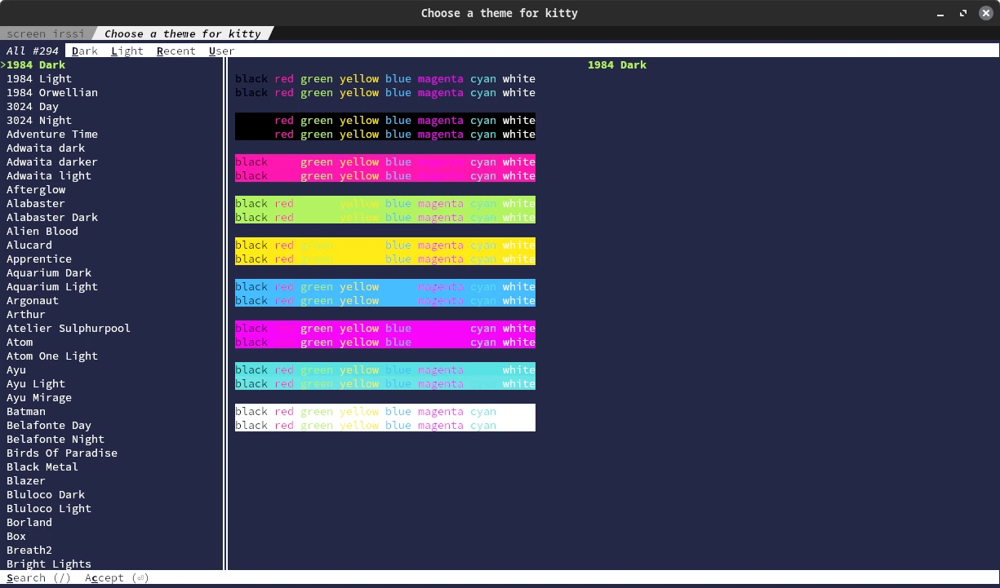
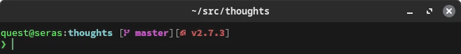

+++
title = "kitty, Starship and Terminal Customization"
date = "2023-09-27T16:31:39-10:00"
author = "quest"
authorTwitter = "zquestz"
cover = "posts/starship/images/spacekitty.webp"
coverCredit = "Space Kitty"
tags = ["code"]
keywords = ["code"]
summary = ""
+++

As someone who spends a significant chunk of time immersed in terminal windows, constantly tweaking and optimizing, I thought I had achieved an ideal setup with zsh and [oh-my-zsh](https://ohmyz.sh/). However, in the spirit of continuous improvement, I recently embarked on a quest for re-evaluation and potential enhancement.

## Re-Evaluating Terminal Emulators

Though I had been a long-time user of the Gnome Terminal (with transparency patches), I decided it was time to reassess the myriad of terminal emulator options available for Linux — all of which I had previously encountered in some capacity. My exploration included [Terminator](https://gnome-terminator.org/), [Alacritty](https://alacritty.org/), [kitty](https://sw.kovidgoyal.net/kitty/), rxvt, and xterm, among others.

This wasn’t a mere surface-level trial; each emulator was meticulously configured to mirror my preferences, with a deep dive into their documentation to ensure a comprehensive understanding of their respective features. My findings? kitty unequivocally stood out as the superior option, meeting the essential criteria:

- Speedy and responsive performance
- Support for split windows, tabs, and transparency
- Smooth scrolling with functional page-up/page-down
- High-quality font support

kitty not only fulfilled, but exceeded expectations. Below is a copy of my `~/.config/kitty/kitty.conf` for those interested:

```
background_opacity	0.9
font_size		10.0
font_family		SauceCodePro Nerd Font Mono
bold_font		auto
italic_font		auto
bold_italic_font	auto
tab_bar_style		powerline
tab_powerline_style	slanted
tab_bar_edge		top
tab_bar_margin_height	0.0 0.0
map kitty_mod+enter 	new_window_with_cwd
map kitty_mod+n		new_os_window_with_cwd
map kitty_mod+t		new_tab_with_cwd

# BEGIN_KITTY_THEME
# Wez
include current-theme.conf
# END_KITTY_THEME
```

A noteworthy feature of the config, are the `map` commands, allowing newly opened terminals to inherit the current working directory, a practical deviation from the default home directory.

Adjusting themes is a breeze with `kitty +kitten themes`, providing an intuitive theme selector while automatically updating your `kitty.conf`.



Additionally, kitty supports image rendering in the terminal through `kitty +kitten icat <file>` and offers integration with `w3m` and other terminal applications, detailed on their [website](https://sw.kovidgoyal.net/kitty/integrations/).

## Revamping Prompts with Starship

Now that I had a shiny new terminal emulator, my attention shifted to enhancing my zsh/bash prompts. Although [Starship](https://starship.rs/) was on my radar, I had not dedicated time to thoroughly explore its capabilities until now.

While its out-of-the-box appearance felt cluttered, a few adjustments revealed Starship's true potential, aligning seamlessly with my kitty theme. The final configuration, significantly influenced by the Nerd Font Symbols and Bracketed Segments Starship presets, resulted in a prompt that is as functional as it is aesthetically pleasing.



For those keen to review my extensive Starship configuration, see the collapsed section below:


[aws]
symbol = " "
format = '\[[$symbol($profile)(\($region\))(\[$duration\])]($style)\]'

[buf]
symbol = " "

[bun]
format = '\[[$symbol($version)]($style)\]'

[c]
symbol = " "
format = '\[[$symbol($version(-$name))]($style)\]'

[cmake]
format = '\[[$symbol($version)]($style)\]'

[cmd_duration]
format = '\[[󰔛 $duration]($style)\]'

[cobol]
format = '\[[$symbol($version)]($style)\]'

[conda]
symbol = " "
format = '\[[$symbol$environment]($style)\]'

[crystal]
format = '\[[$symbol($version)]($style)\]'

[daml]
format = '\[[$symbol($version)]($style)\]'

[dart]
symbol = " "
format = '\[[$symbol($version)]($style)\]'

[deno]
format = '\[[$symbol($version)]($style)\]'

[directory]
read_only = " 󰌾"
format = '[$before_root_path]($before_repo_root_style)[$repo_root]($repo_root_style)[$path]($style)[$read_only]($read_only_style) '

[directory.substitutions]
"Android" = ""
"Desktop" = ""
"Documents" = "󰈙"
"Downloads" = "󰇚"
"Dropbox" = ""
"Games" = ""
"Music" = ""
"Pictures" = ""
"Videos" = ""

[docker_context]
symbol = " "
format = '\[[$symbol$context]($style)\]'

[dotnet]
format = '\[[$symbol($version)($tfm)]($style)\]'

[elixir]
symbol = " "
format = '\[[$symbol($version \(OTP $otp_version\))]($style)\]'

[elm]
symbol = " "
format = '\[[$symbol($version)]($style)\]'

[erlang]
format = '\[[$symbol($version)]($style)\]'

[fennel]
format = '\[[$symbol($version)]($style)\]'

[fossil_branch]
symbol = " "
format = '\[[$symbol$branch]($style)\]'

[gcloud]
symbol = " "
format = '\[[$symbol$account(@$domain)(\($region\))]($style)\]'
disabled = true

[git_branch]
symbol = " "
format = '\[[$symbol$branch]($style)\]'

[git_status]
format = '([\[$all_status$ahead_behind\]]($style))'

[golang]
symbol = " "
format = '\[[$symbol($version)]($style)\]'

[gradle]
format = '\[[$symbol($version)]($style)\]'

[guix_shell]
symbol = " "
format = '\[[$symbol]($style)\]'

[haskell]
symbol = " "
format = '\[[$symbol($version)]($style)\]'

[haxe]
symbol = " "
format = '\[[$symbol($version)]($style)\]'

[helm]
format = '\[[$symbol($version)]($style)\]'

[hg_branch]
symbol = " "
format = '\[[$symbol$branch]($style)\]'

[hostname]
ssh_symbol = "󰣀 "
ssh_only = false
format = '[$ssh_symbol$hostname]($style):'
style = 'bright-green'

[java]
symbol = " "
format = '\[[$symbol($version)]($style)\]'

[julia]
symbol = " "
format = '\[[$symbol($version)]($style)\]'

[kotlin]
format = '\[[$symbol($version)]($style)\]'

[kubernetes]
format = '\[[$symbol$context( \($namespace\))]($style)\]'

[lua]
symbol = " "
format = '\[[$symbol($version)]($style)\]'

[memory_usage]
symbol = "󰍛 "
format = '\[$symbol[$ram( | $swap)]($style)\]'

[meson]
symbol = "󰔷 "
format = '\[[$symbol$project]($style)\]'

[nim]
symbol = "󰆥 "
format = '\[[$symbol($version)]($style)\]'

[nix_shell]
symbol = " "
format = '\[[$symbol$state( \($name\))]($style)\]'

[nodejs]
symbol = " "
format = '\[[$symbol($version)]($style)\]'

[ocaml]
format = '\[[$symbol($version)(\($switch_indicator$switch_name\))]($style)\]'

[opa]
format = '\[[$symbol($version)]($style)\]'

[openstack]
format = '\[[$symbol$cloud(\($project\))]($style)\]'

[os]
format = '\[[$symbol]($style)\]'

[os.symbols]
Alpaquita = " "
Alpine = " "
Amazon = " "
Android = " "
Arch = " "
Artix = " "
CentOS = " "
Debian = " "
DragonFly = " "
Emscripten = " "
EndeavourOS = " "
Fedora = " "
FreeBSD = " "
Garuda = "󰛓 "
Gentoo = " "
HardenedBSD = "󰞌 "
Illumos = "󰈸 "
Linux = " "
Mabox = " "
Macos = " "
Manjaro = " "
Mariner = " "
MidnightBSD = " "
Mint = " "
NetBSD = " "
NixOS = " "
OpenBSD = "󰈺 "
openSUSE = " "
OracleLinux = "󰌷 "
Pop = " "
Raspbian = " "
Redhat = " "
RedHatEnterprise = " "
Redox = "󰀘 "
Solus = "󰠳 "
SUSE = " "
Ubuntu = " "
Unknown = " "
Windows = "󰍲 "

[package]
symbol = "󰏗 "
format = '\[[$symbol$version]($style)\]'

[perl]
format = '\[[$symbol($version)]($style)\]'

[php]
format = '\[[$symbol($version)]($style)\]'

[pijul_channel]
symbol = " "
format = '\[[$symbol$channel]($style)\]'

[pulumi]
format = '\[[$symbol$stack]($style)\]'

[purescript]
format = '\[[$symbol($version)]($style)\]'

[python]
symbol = " "
format = '\[[${symbol}${pyenv_prefix}(${version})(\($virtualenv\))]($style)\]'

[rlang]
symbol = "󰟔 "
format = '\[[$symbol($version)]($style)\]'

[raku]
format = '\[[$symbol($version-$vm_version)]($style)\]'

[red]
format = '\[[$symbol($version)]($style)\]'

[ruby]
symbol = " "
format = '\[[$symbol($version)]($style)\]'

[rust]
symbol = " "
format = '\[[$symbol($version)]($style)\]'

[scala]
symbol = " "
format = '\[[$symbol($version)]($style)\]'

[spack]
format = '\[[$symbol$environment]($style)\]'

[sudo]
format = '\[[as $symbol]($style)\]'

[swift]
format = '\[[$symbol($version)]($style)\]'

[terraform]
format = '\[[$symbol$workspace]($style)\]'

[time]
format = '\[[$time]($style)\]'

[username]
format = '[$user@]($style)'
show_always = true
style_user = 'bright-green'
style_root = 'bright red'

[vagrant]
format = '\[[$symbol($version)]($style)\]'

[vlang]
format = '\[[$symbol($version)]($style)\]'

[zig]
format = '\[[$symbol($version)]($style)\]'

[solidity]
format = '\[[$symbol($version)]($style)\]'


## Final Thoughts

This re-evaluation was not just about discovering new tools but revisiting and reassessing familiar ones with a fresh perspective. It was a day well spent, culminating in a terminal experience that is more refined and personalized than ever. I encourage you to periodically revisit and re-evaluate your tools, you might be surprised by the newfound appreciation and potential improvements you’ll uncover!
